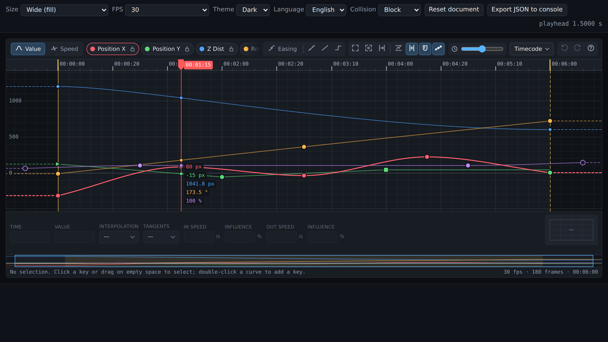

# Graph / Value Editor (keyframe curve UI)

Framework-agnostic keyframe graph editor: value graph, speed graph, Bézier
tangents, easing presets, box selection, transform box, frame-exact time model,
undo/redo transactions, narrow-panel layout. Plain ES modules, no build step,
no dependencies. Mount it in any element (Vegas 3D's WebView, React, Vue, plain
HTML) and drive it through a small document/event API.

Verified in headless Chromium with real pointer/keyboard interactions
(`npm run verify:browser`, 31 checks) and 29 unit tests for the math
(`npm test`). Screenshots: [`docs/screenshots`](docs/screenshots).



## Kullanım (TR)

```html
<link rel="stylesheet" href="graph-editor/src/view/theme.css">
<div id="graph" style="width:100%;height:320px"></div>
<script type="module">
  import { createGraphEditor } from './graph-editor/src/index.js';

  const editor = createGraphEditor(document.getElementById('graph'), {
    locale: 'tr',
    document: {
      fps: { num: 30000, den: 1001 },        // 29.97 — pay/payda olarak, yuvarlanmış float değil
      range: { start: 0, end: 6 },           // event aralığı [S, E): sınır 6.000 s, son kare 179
      channels: [
        { id: 'pos.x', name: 'Position X', shortName: 'X', unit: 'px', color: '#ff5f6d',
          keys: [{ id: 'k1', t: 0, v: -320 }, { id: 'k2', t: 3, v: 80 }, { id: 'k3', t: 6, v: 0 }] },
      ],
    },
  });

  editor.on('change', (e) => host.saveAnimation(e.document)); // her mantıksal düzenlemede bir kez
  editor.on('playhead', (e) => host.seek(e.time));            // kullanıcı cetvelde scrub yaptı
  host.onTimeChanged((t) => editor.setPlayhead(t, 'host'));   // VEGAS playhead'i → editör
</script>
```

Tüm düzenlemeler tek mantıksal işlem olarak kaydedilir: bir sürükleme = bir
undo kaydı; canlı güncellemeler işlem başlangıç anındaki veriden yeniden
uygulanır (birikimli yuvarlama kayması yok). Keyframe'ler ana veridir; render
için ara nokta üretilmez, kaydedilmez.

## Document format

```ts
{
  fps: { num: 30000, den: 1001 },          // rational frame rate (fpsFromNumber(29.97) also works)
  range: { start: 0, end: 6 },             // seconds; displayed frames are [start, end)
  channels: [{
    id, name, shortName?, unit?, color?, group?, visible?, locked?,
    extrapolation?: { pre: 'hold'|'linear'|'cycle'|'pingpong', post: ... },
    keys: [{
      id,                                  // stable id, independent of the name
      t, v,                                // seconds, channel units (degrees stay degrees: 720 is 720)
      interp: 'bezier'|'linear'|'hold',    // the segment leaving this key
      tangents: 'auto'|'unified'|'broken',
      in:  { dt: -0.33, dv: 2 },           // weighted handles in real units (seconds, value)
      out: { dt:  0.33, dv: 2 },
    }],
  }],
}
```

Unknown fields on channels and keys are preserved through load/save, so host
metadata (retiming policy, canonical times, roles) survives round trips.
`getDocument()` returns only persistent data, never UI state.

## Behaviour contract

| Topic | Behaviour |
| --- | --- |
| Time model | One rational `fps`. Frame ↔ seconds conversions live in `src/core/time.js` only. Ruler, playhead, grid, inspector and snapping share it. 29.97 is `30000/1001`, never re-derived from a label. |
| End boundary | `range.end` is the boundary; the last displayable frame is `ceil(frames) - 1`. A key may sit exactly on the boundary. `fitsInRange` uses a tolerance of 1e-4 frame, so 6.007 s at 30 fps correctly does **not** fit. |
| Snapping | Dragged/typed/nudged keys land on frames. The grabbed key snaps; every other selected key moves by the **same** delta, so spacing is preserved and subframe keys stay subframe. `Ctrl` while dragging disables snapping (explicit subframe). Bézier handle coordinates are never rounded. |
| Collisions | Moving onto an occupied frame in the same channel: `block` (default) stops at the last free frame and shows a red marker + status text; `replace` removes the other key. Paste always replaces. Nothing is merged silently. |
| Inserting keys | Double-click a curve: the segment is split with de Casteljau, so the motion does not change (verified to 1e-7). Exactly one key is added. Neighbours that were `auto` become explicit so their shape is kept. |
| Easing target | Click a curve → that segment is the target (works for the last incoming segment). One selected key → both adjacent segments. Several keys → segments with both ends selected. Presets touch only the two handles facing each other; the far handles stay. |
| Tangents | `auto` = Fritsch–Carlson monotone slopes (no overshoot, flat at extrema). `unified` keeps in/out collinear with independent lengths. `broken` edits one side only (`Alt`-drag). Handles are clamped inside their segment so time never reverses. |
| Value vs. speed | Value graph shows real units. Speed graph shows units/second (analytic derivative); dragging a speed handle edits speed + influence. The easing inset shows the **normalized** timing curve and is labelled separately so it is never mistaken for a value graph. |
| Normalize | Each channel is scaled to 0–100 % of its own range for comparison. Dragging still edits real values (per-channel scale). Vertical transform-box handles are disabled in this mode. |
| Undo | Internal stack by default. `undo: 'external'` disables it and emits `transaction` `{label, before, after}` so the host's undo system owns history; apply with `store.applySnapshot(snapshot)`. Preview, evaluation and rendering never create transactions. |
| Input fields | Comma or dot decimals, `75` (frames), `2,5s`, `00:02:15`, `+12` (relative). Invalid text is flagged red and ignored, never coerced to 0. `Delete`, arrows and shortcuts are inert while a field has focus. |
| Idle | No timers, no animation loop. Rendering is dirty-flag + one `requestAnimationFrame`. The only animation is a 180 ms key-insert pulse, skipped under `prefers-reduced-motion`. |
| Layout | Fills its container. `contain: inline-size` so it never widens the host. Panel resize keeps the visible time/value window. Breakpoints: `narrow` < 760 px (icon-only), `tiny` < 520 px (two-row toolbar, short channel names), `short` < 330 px height (no inset/navigator), `micro` < 190 px (plot + toolbar only). |

## Interactions

| Input | Action |
| --- | --- |
| Drag empty space | Box select (`Shift` add, `Alt` remove, `Ctrl` toggle) — no select mode needed |
| Click / `Shift` / `Ctrl` click | Select / add / toggle a key; click a curve to select a segment |
| Drag key(s) | Move; `Shift` locks the dominant axis; `Ctrl` = free subframe; snaps to other keys/playhead/range edges when "Snap to keys" is on |
| Drag handle | Edit tangent; `Alt` breaks; `Shift` flattens |
| Transform box edges (2+ keys) | Scale time (left/right) or value (top/bottom) around the opposite edge |
| Double-click curve | Insert key preserving the motion; `Ctrl`+double-click empty: add key on the active channel at that value |
| Double-click key | Jump to the time field in the inspector |
| Right-click | Context menu: insert, easing presets, interpolation, tangents, copy/paste/duplicate/delete, fit |
| Wheel / `Shift`+wheel | Zoom time around the cursor / pan time |
| `Ctrl`+wheel / `Alt`+wheel | Zoom value / zoom both; trackpad horizontal scroll pans |
| Middle drag, `Space`+drag | Pan |
| Ruler drag | Scrub the playhead (frame-snapped) · double-click ruler = fit all |
| Navigator strip | Drag the window to pan, click to jump, wheel to zoom |
| `F` / `Shift+F` / `Home` | Fit all / fit selection / fit event range |
| `← →` (`Shift` ×10) | Nudge selected keys by frames (moves the playhead when nothing is selected) |
| `↑ ↓` (`Shift` ×10) | Nudge values by one minor grid step |
| `[` `]` | Playhead to previous / next key |
| `,` `.` | Select previous / next key of the active channel |
| `1` `2` `3` | Bezier / Linear / Hold |
| `Delete`, `Ctrl+Z/Y`, `Ctrl+A/C/V/D`, `Esc`, `?` | Delete, undo/redo, select all, copy, paste at playhead, duplicate, cancel/clear, shortcuts |
| Channel chips | Click = visibility, lock icon = lock, `Alt`+click = solo, double-click = fit channel |

Key shapes: ● auto-tangent Bézier, ◆ manual Bézier, ▶ linear, ■ hold. Hollow
dashed keys lie outside the event range (kept, never clamped). Locked channels
render dimmed and cannot be selected or edited.

## API

```ts
const editor = createGraphEditor(container, options);
editor.setDocument(doc); editor.getDocument();
editor.setPlayhead(t, 'host'); editor.getPlayhead();
editor.setMode('value' | 'speed'); editor.setNormalize(bool);
editor.setOption('snapFrames' | 'snapKeys' | 'showHandles' | 'timeFormat' | 'collision', value);
editor.setFps(fps); editor.setRange({ start, end });
editor.selectKeys(ids); editor.getSelection();
editor.applyEasing('easeInOut' | [x1, y1, x2, y2]);
editor.fitAll(); editor.fitSelected(); editor.fitRange();
editor.undo(); editor.redo();
editor.setLocale('tr' | 'en' | stringsObject); editor.setTheme('dark' | 'light' | 'auto');
editor.resize(); editor.destroy();
editor.on('change' | 'transaction' | 'selection' | 'playhead' | 'viewchange' | 'modechange' | 'request-undo' | 'request-redo', fn);
editor.store // GraphStore: moveKeys, insertKey, setHandle, applyEasing, scaleKeys, copy/paste, evalChannel …
```

Pure helpers are exported too (`evalKeys`, `splitSegment`, `retimeKeys`,
`shiftKeys`, `fpsFromNumber`, `formatTime`, `parseTime`, …) so the host can
evaluate the same curves the UI shows. `retimeKeys(keys, A, Ds, a, Dt)` is the
canonical proportional retime from the brief (`t' = a + (t − A)·Dt/Ds`,
outside points mapped, handle `dt` scaled by `k`, `dv` unchanged).

Theme tokens are CSS custom properties on `.ge-root` (`--ge-accent`,
`--ge-plot-bg`, …); `data-theme="light"` is built in.

## Host integration notes (Vegas 3D)

- Keep **one** rational fps and the event range in the document; call
  `setRange`/`setFps` when the host event changes. Store canonical/source
  times for retiming in channel or key metadata (preserved on round trip).
- Sync playhead both ways: `playhead` event (`source: 'user'`) → host seek;
  host time → `setPlayhead(t, 'host')`.
- With the VEGAS undo system, use `undo: 'external'` and mirror
  `transaction` events; call `store.applySnapshot(before|after)` on host undo/redo.
- Keyboard: the editor only handles keys while its root has focus and no text
  field is active; `Space` is left to the host for play/pause.
- Cleanup: `destroy()` removes listeners, the ResizeObserver and any open menu.

## Development

```
npm test                 # 29 unit tests: time model, curves, store
npm run verify:browser   # 31 headless-Chromium interaction checks (needs playwright)
npm run demo             # static server for demo/index.html
node scripts/verify-browser.mjs --screenshots docs/screenshots   # refresh docs
```

## Known limits

- Touch pinch-zoom is not implemented (wheel, slider and navigator zoom are).
- Timecode display is non-drop-frame; frames are exact, only the label format differs.
- Speed-graph handle dragging edits one key at a time (keys move in time only there).
- The component is UI + math only; it does not talk to VEGAS or an OFX renderer.
