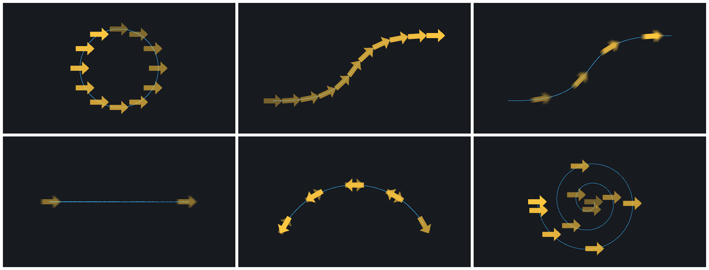
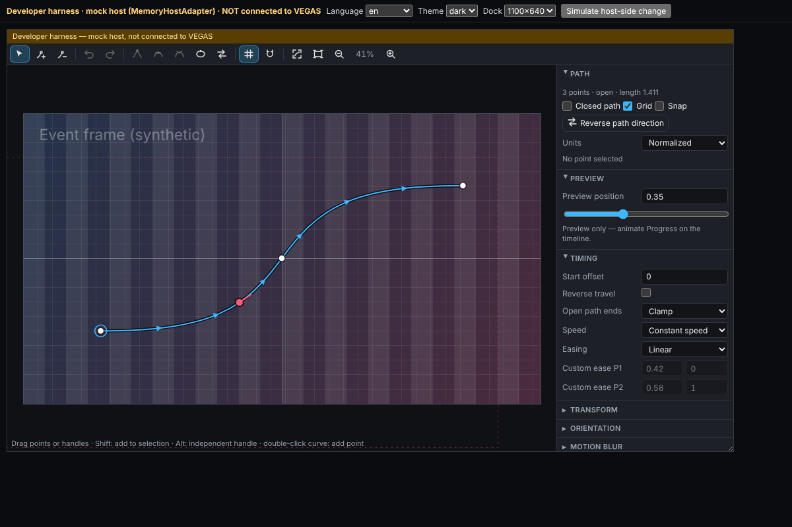

# Wron Motion Path (VEGAS Pro 2026) — geliştirici sürümü

Bir video veya görseli, düzenlenebilir bir Bézier hareket yolu boyunca taşıyan OFX efekti, onun hesaplama çekirdeği ve Wron Main Panel'e gömülecek yol editörü.

> **Durum:** Wron Transform OFX, Main Panel, WebView köprüsü, kurulum ve lisans kaynakları bu depoda **yok** (`docs/00-STATE-MAP.md`). Buradaki kod bu parçalara **bağlanmadı**; gerçek VEGAS'ta **test edilmedi**. Üretilen eklenti yalnızca geliştirici derlemesidir, lisans kontrolü içermez ve **dağıtılmamalıdır**.



*Gerçek eklenti ikilisinin sahte OFX host üzerinden ürettiği kareler (soğan kabuğu). Sırasıyla: çemberde sabit hız; S eğrisinde yola göre yönlenme; 180° hareket bulanıklığı; açık yolda loop sınırı (iki uçta kısmi kopya, arada iz yok); ping-pong'da hareket yönüne bakma; spiralde ease in-out.*



## İçerik

| Klasör | Ne |
| --- | --- |
| `core/` | Bağımlılıksız C++17: yol modeli, sürümlü JSON belge, Bézier ve yay uzunluğu, Progress eşlemesi, poz, CPU renderer, motion blur planı, presetler, süre uyarlaması, örnek başına önbellek |
| `ofx/` | OpenFX 1.5.1 C API eklentisi (filter context), overlay interact, mock OFX host ve uçtan uca testler |
| `editor/` | Çerçeveden bağımsız ES-modül yol editörü (8 dil), host adaptör sözleşmesi, testler, demo |
| `tools/` | Benchmark, C++ → JS altın vektörleri, parametre dökümü, render sheet |
| `docs/` | Durum haritası, VEGAS 2026 araştırması, sözleşmeler, host doğrulama planı, entegrasyon, durum raporu |

## Derleme ve testler

```bash
# C++ çekirdek, eklenti, mock host testleri (Linux)
cmake -S . -B build -G Ninja -DCMAKE_BUILD_TYPE=Release
cmake --build build
ctest --test-dir build --output-on-failure

# Windows (VEGAS hedefi), Visual Studio 2022
cmake -S . -B build -G "Visual Studio 17 2022" -A x64
cmake --build build --config Release
# -> build\WronMotionPath.ofx.bundle\Contents\Win64\WronMotionPath.ofx

# Editör
cd editor
node --test test/*.test.js
node scripts/verify-browser.mjs --screenshots /tmp/shots   # Playwright + Chromium gerekir
python3 -m http.server 8765 --directory ..                 # http://127.0.0.1:8765/editor/demo/index.html
```

Yardımcı araçlar: `build/wmp_bench` (render maliyeti), `build/wmp_golden > testdata/golden.json`, `build/wmp_ofx_describe <ofx> > testdata/ofx-params.json`, `build/wmp_render_sheet <ofx> > s.pam && python3 tools/pam_to_png.py s.pam s.png`.

## Kısaca davranış

- Path (güzergâh) ile Progress (o güzergâhtaki zamanlama) birbirinden bağımsız. Progress 0 başlangıç, 1 son. Varsayılan modda yay uzunluğuna göre sabit hız.
- Koordinatlar normalize: (0.5, 0.5) merkez, +Y aşağı. Pozitif rotation ekranda saat yönünde. Transform sırası: pivot → ölçek → rotation → yol noktası + ofset.
- Yol, efekt örneği başına `wmpPathData` string parametresinde sürümlü JSON olarak saklanır (proje ile birlikte).
- Ayrıntılar: `docs/02-CONTRACTS.md`.
