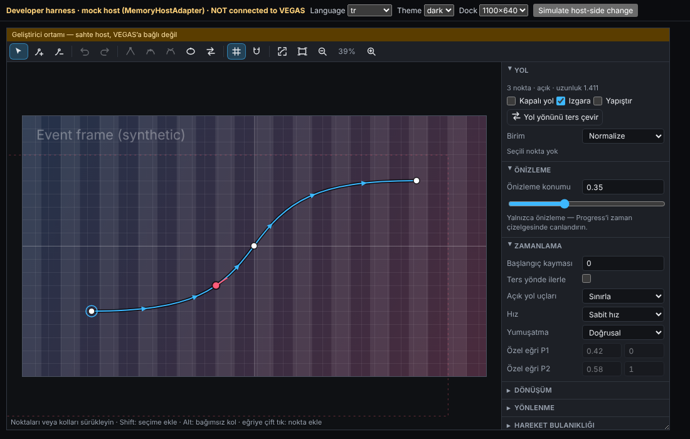
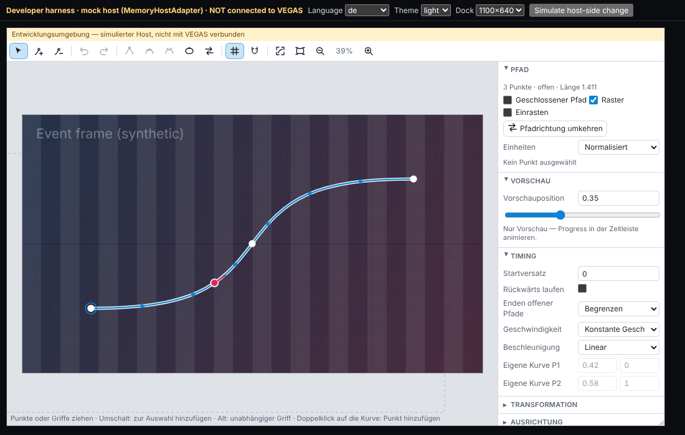
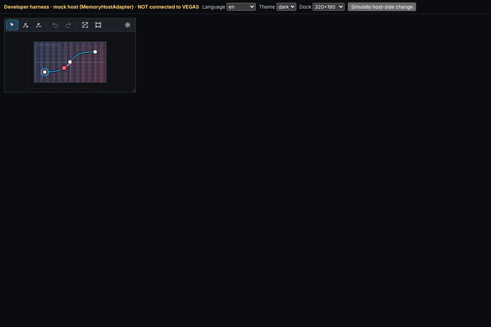
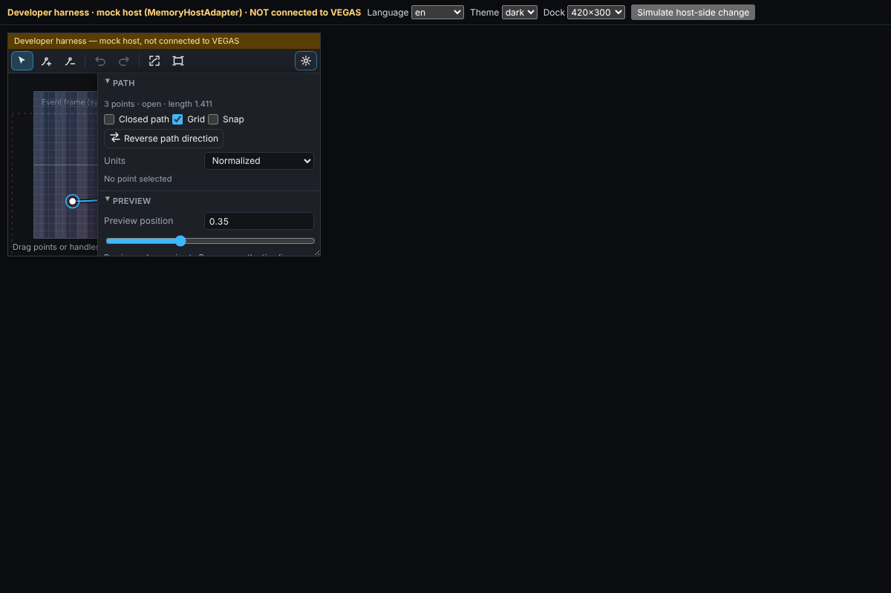

# 05 — Durum raporu

Tarih: 2026-10-06 · Hedef host: VEGAS Pro 2026 (Windows 11 x64) · Derleme: **yalnızca geliştirici derlemesi (DEV)**

## 1. Ne yapıldı, nerede doğrulandı

| Parça | Durum | Doğrulama | Gerçek VEGAS'ta |
| --- | --- | --- | --- |
| Yol veri modeli ve sürümlü belge (`core/`) | Uygulandı | C++ birim testleri; bozuk, gelecek sürüm ve geçiş zinciri senaryoları | Hayır |
| Cubic Bézier, uyarlamalı yay uzunluğu, sabit hız | Uygulandı | Yoğun polyline referansı (2·10⁻⁸ göreli), ters dönüşüm, sıfır uzunluk, sivri uç, kapalı yol | Hayır |
| Progress: clamp/extend/loop/ping-pong, reverse, offset, easing, segment başına eşit süre | Uygulandı | Birim testleri, rastgele erişimde determinizm | Hayır |
| Yola göre yönlenme (sağlam teğet, travel/path yönü, uzamsal yumuşatma) | Uygulandı | Köşe sürekliliği, çember matris sürekliliği, ping-pong dönüşü | Hayır |
| CPU renderer (premultiplied, mip ve anizotropik filtre, saydam kenar, U8/U16/F32 × RGBA/BGRA × premult/straight/opaque, alan render'ı) | Uygulandı | Birim testleri, mock host uçtan uca | Hayır |
| Motion blur (shutter angle/phase, sabit ve uyarlamalı örnek, önizleme azaltma, süreksizlik farkındalığı) | Uygulandı | Birim ve mock host testleri, ölçülen maliyet | Hayır |
| Presetler (7), süre uyarlaması (fit/preserve, sürüklenmesiz), örnek başına geometri önbelleği | Uygulandı | Birim testleri, 8 iş parçacıklı eşzamanlılık testi | Hayır |
| OFX eklentisi (OpenFX 1.5.1 C API; 2026 için VEGAS uzantıları seçimli) | Uygulandı, **DEV** | Mock host ile 16 uçtan uca test; ASan/UBSan/LSan ve TSan temiz; MinGW ve **MSVC 19.44 (GitHub Actions) derlemesi** | **Hayır** |
| OFX overlay (önizlemede düzenleme; Draw Suite V2 + OpenGL V1) | Uygulandı | Mock host (Draw Suite çağrıları), OSMesa ile gerçek OpenGL çizimi | **Hayır.** Üçüncü taraf interact desteği doğrulanmalı |
| Yol editörü bileşeni (8 dil) | Uygulandı | 17 Node testi (C++ altın vektörleri ve eklentinin parametre dökümüyle karşılaştırma dahil), headless Chromium'da 56 gerçek fare/klavye kontrolü | Main Panel'e **bağlanmadı** |
| Main Panel köprüsü (C#/WebView) | **Yapılmadı.** Kaynaklar yok | — | — |
| GPU yolu | **Yapılmadı.** Wron motoru yok | Eklenti GPU desteği bildirmiyor | — |
| Kurulum entegrasyonu | **Yapılmadı.** Kurulum sistemi yok | Yalnızca bundle yapısı üretiliyor | — |
| Lisans | **Yok, bilerek.** Müşteri derlemesi CMake'te engelli | — | — |

## 2. Testler (bu oturumda çalıştırılan)

| Paket | Sonuç |
| --- | --- |
| `wmp_core_tests` (C++ çekirdek) | 56/56 |
| `wmp_ofx_host_tests` (gerçek `.ofx` + mock host) | 16/16 |
| `wmp_ofx_gl_overlay_test` (OSMesa ile OpenGL overlay) | 1/1 |
| ASan + UBSan + LSan (çekirdek ve OFX) | Temiz |
| ThreadSanitizer (çekirdek ve OFX) | Temiz. Mock host'taki iki yarış bulundu ve düzeltildi; eklentide yarış çıkmadı |
| Node testleri (editör) | 17/17 |
| Chromium etkileşim kontrolleri (editör) | 56/56 |
| MinGW-w64 Windows x64 çapraz derleme (eklenti) | Uyarısız; yalnızca `OfxGetNumberOfPlugins`/`OfxGetPlugin` dışa aktarılıyor |
| GitHub Actions (commit `999d61f`) | Üç iş de geçti: Linux testleri ve tarayıcı kontrolleri; ASan/UBSan ve TSan; Windows x64 MSVC (Visual Studio 2022) Release derlemesi. Çekirdek testleri Windows'ta da geçti. `dumpbin`: bağımlılıklar yalnızca `KERNEL32.dll` ve `OPENGL32.dll`; dışa aktarılanlar yalnızca `OfxGetNumberOfPlugins` ve `OfxGetPlugin`; `.ofx` 506 KB |

Uçtan uca mock host testlerinin kapsadıkları: parametre kimliklerinin dondurulması; düz yolda başlangıç/orta/bitiş; Bézier'de sabit hız; 23,976 / 29,97 / 59,94 fps ve alt-kare zamanları; kaydet ve yeniden aç; event kopyası bağımsızlığı; eşzamanlı örnek determinizmi; tile ve RoI (kaynak yalnızca istenen bölgeyle); render scale ve PAR; BGRA 8 bit straight alpha; bozuk ve gelecek sürüm veri; düğmelerin tek undo bloğu; identity ve iptal; shutter'a göre bulanıklık; overlay çizimi, sürükleme, ekleme ve silme; kaynakların serbest bırakılması ve unload.

**Bunların hiçbiri VEGAS uyumluluğu kanıtı değildir.** Gerçek host planı: `03-HOST-VERIFICATION.md`.

Editör, tarayıcı doğrulamasında sahte host (MemoryHostAdapter) ile çekilen görüntüler. Main Panel'e bağlı **değildir**; arka plandaki kare sentetiktir:

| Türkçe, geniş | Almanca, açık tema |
| --- | --- |
|  |  |

| Dock 320×180 (micro) | Dock 420×300, ayarlar çekmecesi açık |
| --- | --- |
|  |  |

## 3. Performans (ölçülen)

Ortam: paylaşımlı 4 vCPU Xeon 2,8 GHz konteyner. Ölçümler gürültülü (±%30). Senaryo: kaynak %50 ölçekli, yola göre yönlenmiş, **yarım karede 165 px (1080p) / 330 px (4K) hareket** (uç bir hız). Süreler kare başına, 4 iş parçacığı.

| Örnek | 1080p | 4K |
| --- | --- | --- |
| 1 (bulanıklık yok) | ~27 ms | ~146 ms |
| 8 | ~63 ms | ~318 ms |
| 16 | ~160–200 ms | ~1,0–1,1 s |
| 64 | ~0,46 s | ~2,6 s |
| 256 | ~1,4 s | ~6,9 s |

- Uyarlamalı mod bu hızda 1080p için Draft 42, Preview 83, Good 166, Best 221 örnek seçer. Normal hızlarda çok daha azını seçer; durağan karelerde 1 örnek kullanır.
- Optimizasyon geçmişi: SSE2 bilinear çekirdek, 8 satırlık bant sıralaması ve seviye başına önceden hesaplanmış ölçek. Başlangıçta 4K/256 23,7 sn sürüyordu.
- Darboğaz bellek erişimi (tek iş parçacığında örnek-piksel başına ~18 ns). Sonraki adaylar: AVX2 ile 4 pikseli birlikte işlemek, 8/16 bit kaynaklar için 16 bit sabit noktalı doku, GPU (Wron motoruyla).
- Arc-length tablosu yalnızca yol veya en-boy oranı değişince kurulur. Kare başına planlama 0,01–0,2 ms sürer.

## 4. Değişen dosyalar (bu dal)

- `wron-motion-path/core/` — C++17 çekirdek (`include/wmp/*.h`, `src/*.cpp`, `tests/*.cpp`)
- `wron-motion-path/ofx/src/` — OFX eklentisi (`plugin.cpp`, `overlay.cpp`, `ofx_util.*`, `params.h`, `vegas_ext.h`)
- `wron-motion-path/ofx/tests/` — mock OFX host ve uçtan uca testler
- `wron-motion-path/ofx/third_party/openfx-1.5.1/` — resmî OpenFX başlıkları (BSD-3, upstream commit `ab779510`)
- `wron-motion-path/editor/` — yol editörü (src, test, scripts, demo)
- `wron-motion-path/tools/` — benchmark, altın vektör üretici, parametre dökümü, render sheet, PAM→PNG
- `wron-motion-path/testdata/` — `golden.json`, `ofx-params.json`
- `wron-motion-path/docs/` — bu belgeler ve görseller
- `.github/workflows/wron-motion-path.yml` — CI
- `wron-motion-path/CMakeLists.txt`, `cmake/mingw-w64-x86_64.cmake`

## 5. Kalan sınırlamalar ve sonraki adımlar

1. **Gerçek VEGAS Pro 2026 testi** (`03-HOST-VERIFICATION.md`). Özellikle overlay, gizli string parametrenin kaydı ve kopyalanması, OFX zaman tabanı, `FrameRange`, piksel sırası ve premultiplication.
2. **Wron kaynakları** (`00-STATE-MAP.md` §3). Ardından Transform ile hizalama (`04-INTEGRATION.md` §2), lisans çağrısı ve kurulum koşulları.
3. **Main Panel köprüsü:** adaptör sözleşmesinin C#/WebView2 tarafı. Editörün Wron graph sistemi ve i18n ile birleşmesi.
4. **GPU:** Wron motorunun gerçek yetenekleri görüldükten sonra. CPU referans olarak kalır ve çıktılar karşılaştırılır.
5. **Zamanlama presetleri OFX içinden:** `OfxVegasKeyframeSuite` host'ta doğrulanırsa Main Panel olmadan da uygulanabilir. Şu an yalnızca editör ve adaptör üzerinden çalışıyor.
6. **Bilinen davranış seçimleri:** en-boy oranı değişince normalize koordinatlar korunur (daire elipse döner). Overlay yalnızca tekli seçim yapar (çoklu seçim editörde var). OFX etiketleri İngilizce.
7. Eklenti sürümü `0.1` (DEV). Kimlikler ilk sürümden önce dondurulmalı.
